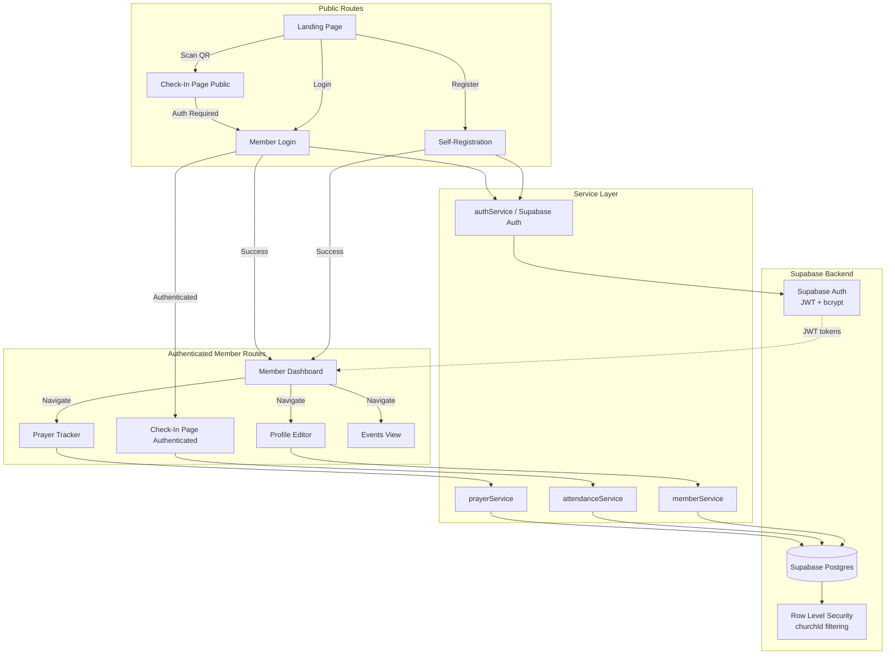
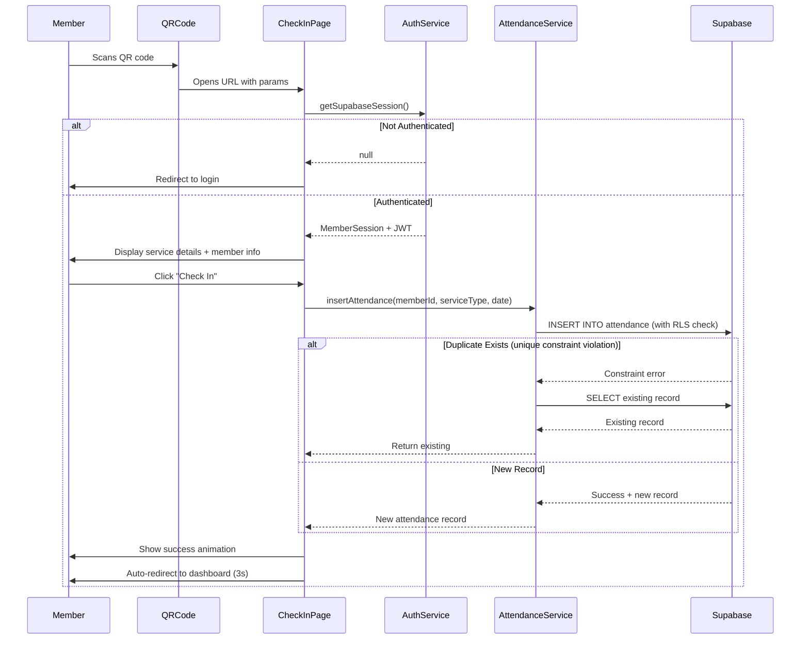
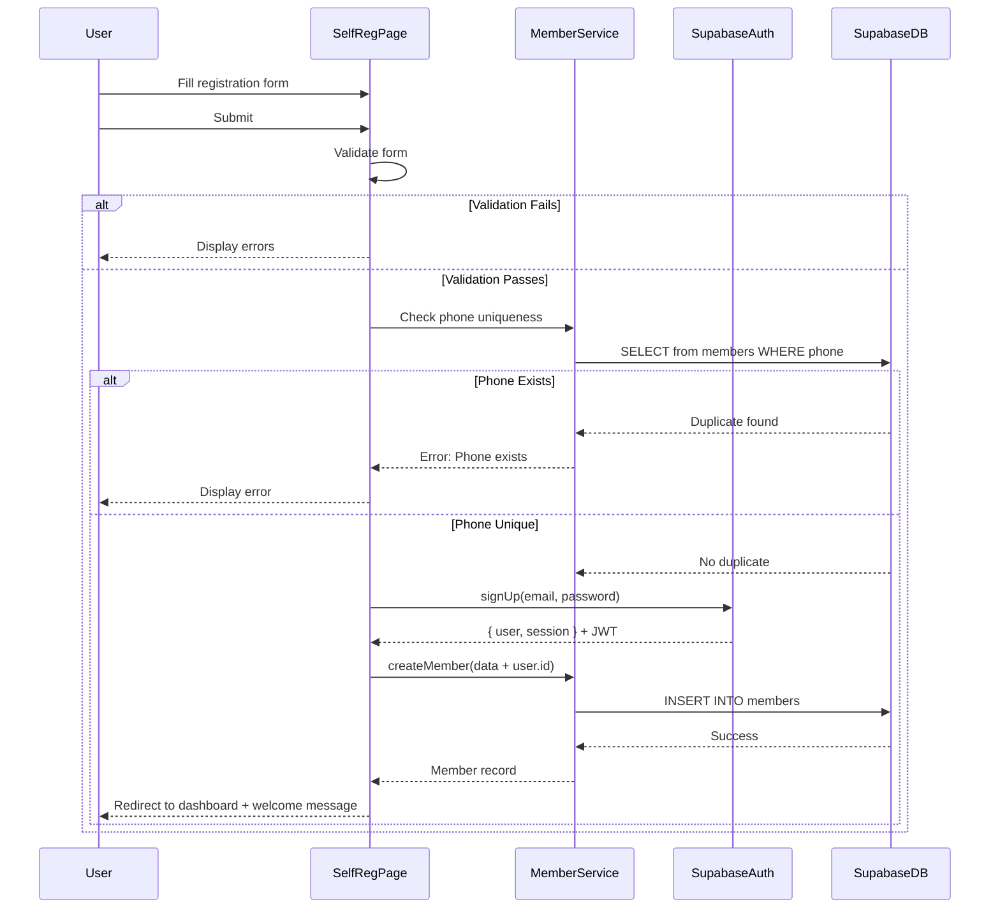
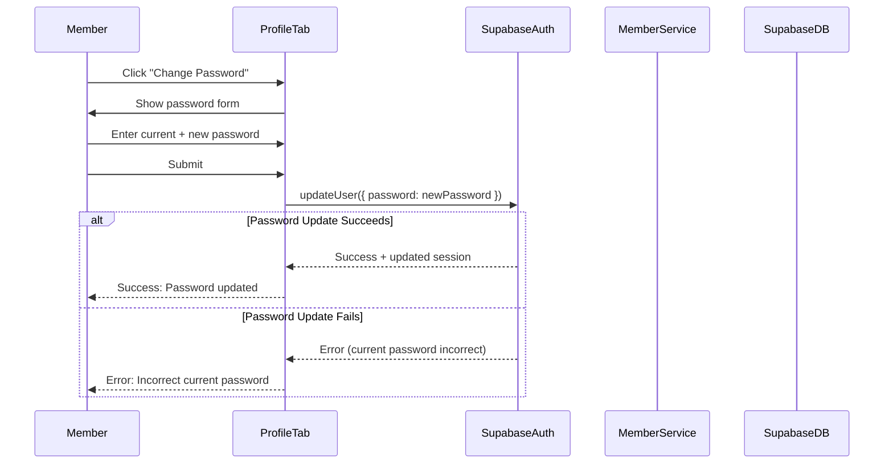

# Design Document: Streamlined Member Portal with QR-Based Check-In

## Overview

This design document specifies the architecture for a streamlined, mobile-first member portal focused on frictionless attendance tracking through QR code scanning. The system empowers members to self-register, manage their own authentication credentials, track their participation, submit prayer requests, and view church events—all without administrator intervention.

The design builds upon the existing React + TypeScript multi-tenant church management application, migrating from localStorage to Supabase for production-ready backend services including Postgres database, authentication, and real-time capabilities.

### Key Design Principles

1. **Member Autonomy**: Members control their own account creation, password management, and profile updates
2. **Frictionless Check-In**: QR code scanning enables one-tap attendance recording in under 5 seconds
3. **Mobile-First**: All interfaces optimized for 320px-768px viewports with touch-friendly controls
4. **Multi-Tenant Security**: Strict churchId isolation via Supabase Row Level Security (RLS) policies across all data operations
5. **Production-Ready**: Supabase Auth handles password hashing, JWT tokens, and session management securely

## Architecture

### System Architecture Diagram



### Component Hierarchy

```
App.tsx
├── Public Routes
│   ├── LandingPage
│   ├── MemberSelfRegistration (NEW)
│   ├── MemberLogin (EXISTING)
│   └── CheckInPage (NEW)
│       ├── QRPayloadParser
│       ├── ServiceConfirmation
│       └── CheckInButton
│
└── Authenticated Member Routes
    ├── MemberDashboardView (REDESIGNED)
    │   ├── MemberHeader
    │   ├── TabNavigation
    │   │   ├── OverviewTab
    │   │   │   ├── ProfileInfoCard
    │   │   │   ├── AttendanceHistoryCard
    │   │   │   └── AttendanceStatsCard
    │   │   ├── PrayersTab
    │   │   │   ├── PrayerSubmissionForm
    │   │   │   └── PrayerHistoryList
    │   │   ├── ProfileTab
    │   │   │   ├── EditableFields
    │   │   │   ├── PasswordManager
    │   │   │   └── ReadOnlyFields
    │   │   └── EventsTab
    │   │       └── EventsList
    │   └── MemberFooter
    │
    └── PasswordResetFlow (NEW)
        ├── ForgotPasswordForm
        └── ResetConfirmation
```

## Components and Interfaces

### 1. MemberSelfRegistration Component

**Purpose**: Public registration interface allowing prospective members to create accounts independently.

**Props**:
```typescript
interface MemberSelfRegistrationProps {
  onBackToPortal: () => void;
  mapName: string;
  defaultChurchId: string;
}
```

**State**:
```typescript
interface RegistrationFormState {
  fullName: string;
  phoneNumber: string;
  email: string;
  password: string;
  confirmPassword: string;
  gender: 'Male' | 'Female';
  department: string;
  level: string;
  faculty: string;
  residence: string;
  birthday: string;
  mapName: string;
  showPassword: boolean;
  isSubmitting: boolean;
  error: string;
  passwordStrength: 'weak' | 'medium' | 'strong';
}
```

**Key Functions**:
- `validateForm()`: Validates all required fields and password requirements
- `checkUniquePhone()`: Verifies phoneNumber uniqueness within churchId
- `checkUniqueEmail()`: Verifies email uniqueness within churchId
- `calculatePasswordStrength()`: Returns strength indicator based on length and complexity
- `handleSubmit()`: Creates member record with hashed password, establishes session, redirects to dashboard

**Validation Rules**:
- Password: minimum 8 characters, at least one numeric character
- Phone: Required, must match format regex
- Email: Optional, must match email regex if provided
- All personal info fields: Required (fullName, gender, department, level, faculty, residence, birthday, mapName)

**UI Elements**:
- Password strength indicator (colored progress bar)
- Show/Hide password toggle
- Real-time validation feedback
- Loading state with disabled submit button
- Error message display area

### 2. CheckInPage Component

**Purpose**: Dedicated route for QR-based and manual attendance check-in.

**Route**: `/check-in`

**Query Parameters**:
- `churchId`: Tenant identifier
- `serviceType`: One of "Sunday Service" | "Midweek Service" | "MAP Meeting" | "Special Program"
- `date`: YYYY-MM-DD format (defaults to current date)
- `time`: HH:MM format (defaults to current time)

**Props**:
```typescript
interface CheckInPageProps {
  onNavigateToDashboard: () => void;
}
```

**State**:
```typescript
interface CheckInState {
  churchId: string | null;
  serviceType: ServiceType | null;
  date: string;
  time: string;
  memberSession: MemberSession | null;
  isChecking In: boolean;
  checkInComplete: boolean;
  error: string | null;
  showManualSelection: boolean;
}
```

**Key Functions**:
- `parseQRPayload()`: Extracts parameters from URL query string
- `validateServiceType()`: Ensures serviceType matches valid enum values
- `handleCheckIn()`: Calls `attendanceService.addAttendance()` with member and service data
- `checkDuplicateAttendance()`: Returns existing record if already checked in for same service/date
- `redirectAfterSuccess()`: Auto-redirects to dashboard after 3 seconds

**QR Code URL Format**:
```
https://[domain]/check-in?churchId=futamap&serviceType=Sunday%20Service&date=2026-06-15&time=09:00
```

**UI Flow**:
1. Parse URL parameters or show manual selectors
2. Display service details and member confirmation
3. Show large "Check In" button (minimum 44px height)
4. On click → Loading state → Success animation → Auto-redirect
5. Error handling with "Try Again" button

**Success Animation**:
- Animated checkmark icon (fade-in + scale)
- Green color scheme
- Success message: "You've been marked present for [Service Type] on [Date]"
- Auto-redirect countdown timer

### 3. MemberDashboardView (Redesigned)

**Purpose**: Centralized member portal with tab-based navigation for attendance tracking, prayers, profile management, and events.

**Props**:
```typescript
interface MemberDashboardViewProps {
  memberId: string;
  onLogout: () => void;
  attendanceHistory: Attendance[];
}
```

**State**:
```typescript
interface MemberDashboardState {
  member: Member | null;
  prayers: PrayerRequest[];
  events: ChurchEvent[];
  activeTab: 'overview' | 'prayers' | 'profile' | 'events';
  attendanceStats: AttendanceStats;
  isLoading: boolean;
}

interface AttendanceStats {
  totalCount: number;
  participationRate: number;
  currentStreak: number;
  sundayServicesCount: number;
  midweekCount: number;
  prayerMeetingsCount: number;
}
```

**Tab Structure**:

#### Overview Tab
- **ProfileInfoCard**: Read-only display of member information
  - Fields: fullName, memberId, department, level, faculty, residence, birthday, dateJoined, mapName
  - Visual indicators for locked fields (lock icon)
  - Profile picture or avatar with initials
  
- **AttendanceHistoryCard**: Chronological list of attendance records
  - Sorted by date descending (most recent first)
  - Grouped by service type with color coding
  - Filter controls (service type, date range)
  - Empty state message with call-to-action

- **AttendanceStatsCard**: Participation metrics
  - Total attendance count
  - Participation rate percentage
  - Current streak with badge (if > 5)
  - Category breakdowns (Sunday/Midweek/Prayer)

#### Prayers Tab
- **PrayerSubmissionForm**: Text area for new prayer requests
  - Character limit: 500 (with counter)
  - Minimum length: 10 characters
  - Submit button with loading state
  - Success confirmation message

- **PrayerHistoryList**: Display of submitted prayers
  - Status badges (Praying/Answered/Ongoing)
  - Date submitted
  - Prayer request text
  - Sorted by date descending

#### Profile Tab
- **EditableFields**: Form for mutable fields
  - phoneNumber (required)
  - email (optional, validated)
  - residence (required)
  - profilePicture URL (optional)
  - Save button with loading state
  - Success/error message display

- **PasswordManager**: Password change interface
  - Current password field
  - New password field (with strength indicator)
  - Confirm new password field
  - Validation and error messages

- **ReadOnlyFields**: Display-only section
  - Lock icons on all fields
  - Help text: "Contact church administrator to update these fields"
  - Fields: memberId, fullName, department, level, faculty, dateJoined, mapName, birthday

#### Events Tab
- **EventsList**: Upcoming church events
  - Filtered to future dates only
  - Sorted chronologically (soonest first)
  - Category badges (program/meeting/special)
  - Event details: title, date, time, location
  - Empty state message

**Header Component**:
```typescript
interface MemberHeaderProps {
  churchName: string;
  mapName: string;
  memberName: string;
  memberId: string;
  profilePicture?: string;
  onLogout: () => void;
}
```

**Mobile Responsive Behavior**:
- Tab navigation converts to horizontal scroll on mobile
- Cards stack vertically
- Touch-optimized button sizes (44px minimum)
- Readable fonts (14px body, 18px buttons)

### 4. PasswordResetFlow Component

**Purpose**: Self-service password reset for members who forgot credentials.

**Props**:
```typescript
interface PasswordResetFlowProps {
  onBackToLogin: () => void;
}
```

**State**:
```typescript
interface PasswordResetState {
  emailOrPhone: string;
  newPassword: string;
  confirmPassword: string;
  step: 'request' | 'reset' | 'confirmation';
  isSubmitting: boolean;
  error: string | null;
}
```

**Flow**:
1. **Request Step**: Enter email or phone number
2. **Reset Step**: Enter new password (with validation)
3. **Confirmation Step**: Display success message, redirect to login

**Key Functions**:
- `validateIdentifier()`: Checks if email or phone format is valid
- `findMemberByIdentifier()`: Matches member record
- `handlePasswordReset()`: Calls `authService.resetMemberPassword()`

## Supabase Database Schema

### Tables

#### `churches` table
```sql
CREATE TABLE churches (
  id TEXT PRIMARY KEY,
  name TEXT NOT NULL,
  map_name TEXT NOT NULL,
  logo_name TEXT,
  created_at TIMESTAMPTZ DEFAULT NOW()
);
```

#### `members` table
```sql
CREATE TABLE members (
  id UUID PRIMARY KEY DEFAULT gen_random_uuid(),
  church_id TEXT NOT NULL REFERENCES churches(id),
  user_id UUID REFERENCES auth.users(id), -- Links to Supabase Auth
  full_name TEXT NOT NULL,
  phone_number TEXT NOT NULL,
  email TEXT,
  gender TEXT CHECK (gender IN ('Male', 'Female')),
  department TEXT,
  level TEXT,
  faculty TEXT,
  residence TEXT,
  birthday DATE,
  date_joined DATE DEFAULT CURRENT_DATE,
  status TEXT DEFAULT 'Active' CHECK (status IN ('Active', 'Inactive')),
  map_name TEXT,
  profile_picture TEXT,
  created_at TIMESTAMPTZ DEFAULT NOW(),
  updated_at TIMESTAMPTZ DEFAULT NOW(),
  UNIQUE(church_id, phone_number),
  UNIQUE(church_id, email)
);
```

#### `attendance` table
```sql
CREATE TABLE attendance (
  id UUID PRIMARY KEY DEFAULT gen_random_uuid(),
  church_id TEXT NOT NULL REFERENCES churches(id),
  member_id UUID NOT NULL REFERENCES members(id),
  date DATE NOT NULL,
  service_type TEXT NOT NULL CHECK (service_type IN ('Sunday Service', 'Midweek Service', 'MAP Meeting', 'Special Program')),
  created_at TIMESTAMPTZ DEFAULT NOW(),
  UNIQUE(member_id, date, service_type) -- Prevent duplicate check-ins
);

CREATE INDEX idx_attendance_member ON attendance(member_id, church_id);
CREATE INDEX idx_attendance_date ON attendance(date DESC);
```

#### `prayer_requests` table
```sql
CREATE TABLE prayer_requests (
  id UUID PRIMARY KEY DEFAULT gen_random_uuid(),
  church_id TEXT NOT NULL REFERENCES churches(id),
  member_id UUID REFERENCES members(id),
  phone_number TEXT NOT NULL,
  full_name TEXT NOT NULL,
  request TEXT NOT NULL CHECK (char_length(request) BETWEEN 10 AND 500),
  status TEXT DEFAULT 'Praying' CHECK (status IN ('Praying', 'Answered', 'Ongoing')),
  date_submitted DATE DEFAULT CURRENT_DATE,
  created_at TIMESTAMPTZ DEFAULT NOW()
);

CREATE INDEX idx_prayer_requests_member ON prayer_requests(member_id, church_id);
```

#### `church_events` table
```sql
CREATE TABLE church_events (
  id UUID PRIMARY KEY DEFAULT gen_random_uuid(),
  church_id TEXT REFERENCES churches(id),
  title TEXT NOT NULL,
  date DATE NOT NULL,
  time TEXT NOT NULL,
  location TEXT,
  category TEXT CHECK (category IN ('program', 'meeting', 'special')),
  created_at TIMESTAMPTZ DEFAULT NOW()
);

CREATE INDEX idx_events_date ON church_events(date ASC);
```

#### `follow_ups` table
```sql
CREATE TABLE follow_ups (
  id UUID PRIMARY KEY DEFAULT gen_random_uuid(),
  church_id TEXT NOT NULL REFERENCES churches(id),
  member_id UUID REFERENCES members(id),
  follow_up_type TEXT NOT NULL,
  notes TEXT,
  assigned_to TEXT,
  status TEXT DEFAULT 'Pending',
  created_at TIMESTAMPTZ DEFAULT NOW()
);
```

### Row Level Security (RLS) Policies

#### Members Table RLS
```sql
ALTER TABLE members ENABLE ROW LEVEL SECURITY;

-- Members can only see their own church's data
CREATE POLICY "Members access own church" ON members
  FOR SELECT
  USING (church_id = (current_setting('app.church_id'::text))::text);

-- Members can only update their own profile (editable fields only)
CREATE POLICY "Members update own profile" ON members
  FOR UPDATE
  USING (user_id = auth.uid())
  WITH CHECK (user_id = auth.uid());

-- New member registration
CREATE POLICY "Anyone can insert members" ON members
  FOR INSERT
  WITH CHECK (true); -- Validated in application layer
```

#### Attendance Table RLS
```sql
ALTER TABLE attendance ENABLE ROW LEVEL SECURITY;

-- Members see only their church's attendance
CREATE POLICY "Attendance church isolation" ON attendance
  FOR SELECT
  USING (church_id = (current_setting('app.church_id'::text))::text);

-- Members can only check themselves in
CREATE POLICY "Members check-in only" ON attendance
  FOR INSERT
  WITH CHECK (
    church_id = (current_setting('app.church_id'::text))::text
    AND member_id IN (
      SELECT id FROM members WHERE user_id = auth.uid()
    )
  );
```

#### Prayer Requests Table RLS
```sql
ALTER TABLE prayer_requests ENABLE ROW LEVEL SECURITY;

-- Members see only their church's prayers
CREATE POLICY "Prayer requests church isolation" ON prayer_requests
  FOR SELECT
  USING (church_id = (current_setting('app.church_id'::text))::text);

-- Members can submit prayer requests
CREATE POLICY "Members submit prayers" ON prayer_requests
  FOR INSERT
  WITH CHECK (
    church_id = (current_setting('app.church_id'::text))::text
  );
```

#### Church Events Table RLS
```sql
ALTER TABLE church_events ENABLE ROW LEVEL SECURITY;

-- Members see their church's events
CREATE POLICY "Events church isolation" ON church_events
  FOR SELECT
  USING (
    church_id = (current_setting('app.church_id'::text))::text
    OR church_id IS NULL -- Global events
  );
```

### Supabase Client Configuration

```typescript
import { createClient } from '@supabase/supabase-js';

const supabaseUrl = import.meta.env.VITE_SUPABASE_URL;
const supabaseAnonKey = import.meta.env.VITE_SUPABASE_ANON_KEY;

export const supabase = createClient(supabaseUrl, supabaseAnonKey);

// Set church_id context for RLS
export async function setChurchContext(churchId: string) {
  await supabase.rpc('set_church_context', { church_id: churchId });
}
```

**Supabase Function for RLS Context:**
```sql
CREATE OR REPLACE FUNCTION set_church_context(church_id TEXT)
RETURNS VOID AS $$
BEGIN
  PERFORM set_config('app.church_id', church_id, false);
END;
$$ LANGUAGE plpgsql SECURITY DEFINER;
```

## Data Models

### Member (Extended)

```typescript
interface Member {
  id: string; // UUID from Supabase
  churchId: string;
  userId?: string; // UUID linking to Supabase Auth users
  fullName: string;
  phoneNumber: string;
  email?: string;
  gender: 'Male' | 'Female';
  department: string;
  level: string;
  faculty: string;
  residence: string;
  birthday: string; // YYYY-MM-DD
  dateJoined: string; // YYYY-MM-DD
  status: 'Active' | 'Inactive';
  mapName: string;
  profilePicture?: string;
}
```

### MemberSession

```typescript
interface MemberSession {
  userId: string; // Supabase Auth user ID
  memberId: string;
  fullName: string;
  churchId: string;
  phoneNumber: string;
  email?: string;
  accessToken: string; // JWT token from Supabase Auth
  refreshToken: string; // Refresh token from Supabase Auth
  authenticatedAt: string; // ISO 8601 timestamp
}
```

### QRPayload

```typescript
interface QRPayload {
  churchId: string;
  serviceType: ServiceType;
  date: string; // YYYY-MM-DD
  time: string; // HH:MM
}
```

### AttendanceRecord

```typescript
interface Attendance {
  id: string;
  churchId: string;
  memberId: string;
  date: string; // YYYY-MM-DD
  serviceType: ServiceType;
}
```

### ChurchEvent

```typescript
interface ChurchEvent {
  id: string;
  churchId?: string;
  title: string;
  date: string; // YYYY-MM-DD
  time: string; // HH:MM AM/PM
  location: string;
  category: 'program' | 'meeting' | 'special';
}
```

## Data Flow Diagrams

### Check-In Flow



### Self-Registration Flow



### Password Management Flow




## API / Service Method Signatures

### AuthService Extensions

```typescript
interface AuthService {
  // Supabase Auth integration
  supabase: SupabaseClient;
  
  // Existing methods (admin-focused)
  getCurrentSession(): ChurchSession | null;
  isAuthenticated(): boolean;
  logout(): void;
  
  // Member authentication via Supabase Auth
  memberSignUp(
    email: string,
    password: string,
    memberData: Omit<Member, 'id' | 'status' | 'churchId' | 'userId'>
  ): Promise<{ member: Member; session: Session }>;
  
  memberSignIn(
    email: string,
    password: string
  ): Promise<{ member: Member; session: Session }>;
  
  getMemberSession(): Session | null;
  
  isMemberAuthenticated(): boolean;
  
  memberSignOut(): Promise<void>;
  
  resetPasswordForEmail(email: string): Promise<void>;
  
  updatePassword(newPassword: string): Promise<void>;
  
  validatePasswordStrength(password: string): {
    isValid: boolean;
    strength: 'weak' | 'medium' | 'strong';
    errors: string[];
  };
}
```

#### Implementation Notes

**`memberSignUp()`**:
1. Validate password meets requirements (min 8 chars, at least one number)
2. Check phone uniqueness in `members` table
3. Check email uniqueness in `members` table (if provided)
4. Call `supabase.auth.signUp({ email, password })`
5. Insert member record into `members` table with `user_id` from Auth
6. Set church context for RLS: `setChurchContext(memberData.churchId)`
7. Return member record and Supabase session (includes JWT)

**`memberSignIn()`**:
1. Call `supabase.auth.signInWithPassword({ email, password })`
2. Retrieve member record from `members` table using `user_id`
3. Set church context for RLS: `setChurchContext(member.churchId)`
4. Return member record and session

**`getMemberSession()`**:
- Call `supabase.auth.getSession()` to retrieve current Supabase session
- Returns session with JWT tokens or null if expired

**`memberSignOut()`**:
- Call `supabase.auth.signOut()`
- Supabase automatically clears session and tokens

**`resetPasswordForEmail()`**:
- Call `supabase.auth.resetPasswordForEmail(email)`
- Sends magic link to user's email for password reset

**`updatePassword()`**:
- Validate newPassword meets requirements
- Call `supabase.auth.updateUser({ password: newPassword })`
- Supabase handles current password verification and hashing

### MemberService Extensions

```typescript
interface MemberService {
  // Supabase client
  supabase: SupabaseClient;
  
  // Existing methods (updated for Supabase)
  getMembers(): Promise<Member[]>;
  getMemberById(id: string): Promise<Member | undefined>;
  addMember(member: Omit<Member, 'id' | 'status'>, userId: string): Promise<Member>;
  updateMember(id: string, updates: Partial<Member>): Promise<Member>;
  
  // New methods for self-registration
  checkPhoneUnique(phoneNumber: string, churchId: string): Promise<boolean>;
  checkEmailUnique(email: string, churchId: string): Promise<boolean>;
  
  getMemberByUserId(userId: string): Promise<Member | undefined>;
  
  getMemberByPhoneOrEmail(
    identifier: string, 
    churchId: string
  ): Promise<Member | undefined>;
  
  updateMemberProfile(
    memberId: string,
    updates: Pick<Member, 'phoneNumber' | 'email' | 'residence' | 'profilePicture'>
  ): Promise<Member>;
}
```

#### Implementation Notes

**`checkPhoneUnique()`**:
```typescript
const { data, error } = await supabase
  .from('members')
  .select('id')
  .eq('church_id', churchId)
  .eq('phone_number', cleanPhone(phoneNumber))
  .single();

return data === null; // true if unique
```

**`checkEmailUnique()`**:
```typescript
const { data, error } = await supabase
  .from('members')
  .select('id')
  .eq('church_id', churchId)
  .eq('email', email.toLowerCase().trim())
  .single();

return data === null; // true if unique
```

**`getMemberByUserId()`**:
```typescript
const { data, error } = await supabase
  .from('members')
  .select('*')
  .eq('user_id', userId)
  .single();

return data || undefined;
```

**`addMember()`**:
```typescript
const { data, error } = await supabase
  .from('members')
  .insert({
    ...member,
    user_id: userId,
    id: undefined // Let Supabase generate UUID
  })
  .select()
  .single();

return data;
```

**`updateMemberProfile()`**:
- Validate memberId matches authenticated user
- Validate phoneNumber is not empty
- Validate email format if provided
```typescript
const { data, error } = await supabase
  .from('members')
  .update(updates)
  .eq('id', memberId)
  .select()
  .single();

return data;
```

### AttendanceService Extensions

```typescript
interface AttendanceService {
  // Supabase client
  supabase: SupabaseClient;
  
  // Existing methods (updated for Supabase)
  getAttendance(): Promise<Attendance[]>;
  getAttendanceHistoryForMember(memberId: string): Promise<Attendance[]>;
  addAttendance(
    memberId: string, 
    memberName: string, 
    serviceType: ServiceType, 
    date: string,
    churchId: string
  ): Promise<Attendance>;
  removeAttendance(id: string): Promise<void>;
  
  // New methods for check-in and statistics
  checkInMember(
    session: Session,
    member: Member,
    serviceType: ServiceType,
    date: string
  ): Promise<{ attendance: Attendance; isDuplicate: boolean }>;
  
  calculateAttendanceStats(
    memberId: string,
    dateRange?: { start: string; end: string }
  ): Promise<AttendanceStats>;
  
  filterAttendanceByServiceType(
    memberId: string,
    serviceType: ServiceType
  ): Promise<Attendance[]>;
  
  filterAttendanceByDateRange(
    memberId: string,
    startDate: string,
    endDate: string
  ): Promise<Attendance[]>;
}

interface AttendanceStats {
  totalCount: number;
  participationRate: number;
  currentStreak: number;
  sundayServicesCount: number;
  midweekCount: number;
  prayerMeetingsCount: number;
  lastAttendanceDate: string | null;
}
```

#### Implementation Notes

**`checkInMember()`**:
```typescript
// Check for duplicate using Supabase unique constraint
const { data: existing, error: selectError } = await supabase
  .from('attendance')
  .select('*')
  .eq('member_id', member.id)
  .eq('date', date)
  .eq('service_type', serviceType)
  .single();

if (existing) {
  return { attendance: existing, isDuplicate: true };
}

// Insert new attendance
const { data, error } = await supabase
  .from('attendance')
  .insert({
    church_id: member.churchId,
    member_id: member.id,
    date,
    service_type: serviceType
  })
  .select()
  .single();

return { attendance: data, isDuplicate: false };
```

**`calculateAttendanceStats()`**:
```typescript
// Retrieve attendance history
const { data: records } = await supabase
  .from('attendance')
  .select('*')
  .eq('member_id', memberId)
  .order('date', { ascending: false });

// Calculate stats from records
// ... (calculation logic remains same)
```

**`getAttendanceHistoryForMember()`**:
```typescript
const { data, error } = await supabase
  .from('attendance')
  .select('*')
  .eq('member_id', memberId)
  .order('date', { ascending: false });

return data || [];
```

### PrayerService Extensions

```typescript
interface PrayerService {
  // Supabase client
  supabase: SupabaseClient;
  
  // Existing methods (updated for Supabase)
  getPrayerRequests(): Promise<PrayerRequest[]>;
  addPrayerRequest(
    prayerRequest: Omit<PrayerRequest, 'id' | 'status' | 'dateSubmitted'>, 
    churchId: string
  ): Promise<PrayerRequest>;
  updatePrayerRequestStatus(id: string, status: PrayerRequest['status']): Promise<PrayerRequest>;
  
  // New methods for member portal
  getMemberPrayerRequests(
    memberId: string,
    churchId: string
  ): Promise<PrayerRequest[]>;
  
  submitMemberPrayerRequest(
    session: Session,
    member: Member,
    requestText: string
  ): Promise<PrayerRequest>;
}
```

#### Implementation Notes

**`getMemberPrayerRequests()`**:
```typescript
const { data, error } = await supabase
  .from('prayer_requests')
  .select('*')
  .eq('member_id', memberId)
  .eq('church_id', churchId)
  .order('date_submitted', { ascending: false });

return data || [];
```

**`submitMemberPrayerRequest()`**:
```typescript
// Validate requestText length (min 10, max 500 chars)
if (requestText.length < 10 || requestText.length > 500) {
  throw new Error('Prayer request must be between 10 and 500 characters');
}

const { data, error } = await supabase
  .from('prayer_requests')
  .insert({
    church_id: member.churchId,
    member_id: member.id,
    phone_number: member.phoneNumber,
    full_name: member.fullName,
    request: requestText,
    status: 'Praying'
  })
  .select()
  .single();

return data;
```

## State Management Approach

### Session Management

**Storage Strategy**:
- **Supabase Client**: Automatically manages session storage using localStorage
- **JWT Tokens**: Access token and refresh token managed by Supabase Auth
- **Auto-refresh**: Supabase client automatically refreshes expired tokens
- **Multi-tab Support**: Session state synchronized across browser tabs

**Session Structure**:
```typescript
// Supabase automatically manages session
// Access via: supabase.auth.getSession()

interface SupabaseSession {
  access_token: string; // JWT token
  refresh_token: string;
  expires_in: number;
  expires_at?: number;
  token_type: 'bearer';
  user: {
    id: string; // User UUID from Supabase Auth
    email: string;
    user_metadata: Record<string, any>;
  };
}

// Helper to get member session
async function getMemberSession(): Promise<MemberSession | null> {
  const { data: { session } } = await supabase.auth.getSession();
  if (!session) return null;
  
  // Fetch member profile from database
  const { data: member } = await supabase
    .from('members')
    .select('*')
    .eq('user_id', session.user.id)
    .single();
  
  if (!member) return null;
  
  // Set church context for RLS
  await setChurchContext(member.church_id);
  
  return {
    userId: session.user.id,
    memberId: member.id,
    fullName: member.full_name,
    churchId: member.church_id,
    phoneNumber: member.phone_number,
    email: member.email,
    accessToken: session.access_token,
    refreshToken: session.refresh_token,
    authenticatedAt: new Date().toISOString()
  };
}

// Logout
async function clearMemberSession() {
  await supabase.auth.signOut();
  // Supabase automatically clears localStorage
}
```

### Route Guards

**Authentication Check**:
```typescript
async function requireMemberAuth(
  component: React.ComponentType, 
  redirectTo: string = 'member-login'
) {
  const { data: { session } } = await supabase.auth.getSession();
  
  if (!session) {
    // Store intended destination
    sessionStorage.setItem('redirect_after_login', window.location.pathname);
    navigate(redirectTo);
    return null;
  }
  
  return component;
}
```

**Multi-Tenant Isolation**:
```typescript
// Enforced via Supabase RLS policies
// Set church context after authentication
async function setChurchContext(churchId: string) {
  await supabase.rpc('set_church_context', { church_id: churchId });
}

// Validate tenant access (application-level check)
function validateTenantAccess(resourceChurchId: string, memberChurchId: string): boolean {
  return resourceChurchId === memberChurchId;
}
```

### Component State Management

**Local State** (useState):
- Form inputs (registration, login, profile editing)
- UI state (active tab, modals, loading indicators)
- Temporary data (password visibility toggles, character counters)

**Effect Hooks** (useEffect):
- Initial data loading on component mount
- Session validation on route changes
- Auto-redirect timers (check-in success)
- Real-time validation (password strength)

**Example Pattern**:
```typescript
const [formData, setFormData] = useState<RegistrationFormState>(initialState);
const [isSubmitting, setIsSubmitting] = useState(false);
const [error, setError] = useState<string | null>(null);

useEffect(() => {
  // Load initial data and check auth
  const checkAuth = async () => {
    const { data: { session } } = await supabase.auth.getSession();
    if (!session) {
      navigate('member-login');
    }
  };
  checkAuth();
}, []);

const handleSubmit = async (e: React.FormEvent) => {
  e.preventDefault();
  setIsSubmitting(true);
  setError(null);
  
  try {
    const result = await authService.memberSignUp(
      formData.email,
      formData.password,
      formData
    );
    navigate('member-dashboard');
  } catch (err: any) {
    setError(err.message);
  } finally {
    setIsSubmitting(false);
  }
};
```

## QR Code Payload Specification

### URL Format

```
https://[domain]/check-in?churchId={id}&serviceType={type}&date={date}&time={time}
```

### Parameters

| Parameter | Type | Required | Format | Example |
|-----------|------|----------|--------|---------|
| `churchId` | string | Yes | Kebab-case tenant ID | `futamap` |
| `serviceType` | string | Yes | URL-encoded service name | `Sunday%20Service` |
| `date` | string | No | YYYY-MM-DD | `2026-06-15` |
| `time` | string | No | HH:MM | `09:00` |

### Service Type Values

Must match exactly (case-sensitive):
- `Sunday Service`
- `Midweek Service` (replaces "Bible Study")
- `MAP Meeting`
- `Special Program` (replaces "Prayer Meeting")

### QR Code Generation

**Recommended Library**: `qrcode.react` or `qrcode`

**Generation Logic**:
```typescript
function generateCheckInQR(
  churchId: string,
  serviceType: ServiceType,
  date?: string,
  time?: string
): string {
  const baseUrl = window.location.origin;
  const params = new URLSearchParams({
    churchId,
    serviceType,
    date: date || new Date().toISOString().split('T')[0],
    time: time || new Date().toTimeString().slice(0, 5)
  });
  
  return `${baseUrl}/check-in?${params.toString()}`;
}
```

**QR Code Display** (Admin Portal):
```typescript
import QRCode from 'qrcode.react';

function ServiceQRCode({ serviceType }: { serviceType: ServiceType }) {
  const session = authService.getCurrentSession();
  const qrData = generateCheckInQR(
    session.churchId,
    serviceType,
    new Date().toISOString().split('T')[0],
    '09:00'
  );
  
  return (
    <div>
      <QRCode value={qrData} size={256} level="H" />
      <p>Scan to check in for {serviceType}</p>
    </div>
  );
}
```

### Parsing Logic

```typescript
function parseCheckInURL(): QRPayload | null {
  const params = new URLSearchParams(window.location.search);
  
  const churchId = params.get('churchId');
  const serviceType = params.get('serviceType') as ServiceType;
  const date = params.get('date') || new Date().toISOString().split('T')[0];
  const time = params.get('time') || new Date().toTimeString().slice(0, 5);
  
  // Validate service type
  const validTypes: ServiceType[] = [
    'Sunday Service',
    'Midweek Service',
    'MAP Meeting',
    'Special Program'
  ];
  
  if (!churchId || !serviceType || !validTypes.includes(serviceType)) {
    return null;
  }
  
  return { churchId, serviceType, date, time };
}
```

## Security Considerations

### 1. Multi-Tenant Data Isolation

**Enforcement Points**:
- All data operations filtered by `churchId` via Supabase RLS policies
- Session validation checks `churchId` match
- URL tampering protection in check-in flow

**Implementation**:
```typescript
// Set church context for RLS after authentication
async function enforc eTenantIsolation(member: Member) {
  await supabase.rpc('set_church_context', { church_id: member.churchId });
}

// RLS policies automatically filter all queries by church_id
// Example: SELECT * FROM attendance 
// → Automatically filtered to WHERE church_id = current_setting('app.church_id')
```

**Applied To**:
- Attendance recording (prevent cross-tenant check-ins via RLS)
- Member profile access (cannot view other tenants' members via RLS)
- Prayer requests (cannot see other tenants' prayers via RLS)
- Event listings (only show events for member's church via RLS)

### 2. Password Security

**Hashing**:
- Supabase Auth uses bcrypt for password hashing (industry standard)
- Never store plaintext passwords
- Passwords never transmitted or stored in application code

**Validation**:
- Minimum 8 characters
- At least one numeric character (0-9)
- Strength indicator displayed to users
- Password reset via secure email magic link

**No Legacy Compatibility Needed**:
- All authentication handled by Supabase Auth from day one
- No manual password hashing or comparison in application code
- JWT tokens automatically managed and refreshed by Supabase client

### 3. Member Self-Registration Security

**Uniqueness Validation**:
- Phone number must be unique within churchId (enforced by Supabase UNIQUE constraint)
- Email must be unique within churchId (enforced by Supabase UNIQUE constraint)
- Prevents duplicate accounts and phone number takeover

**Input Sanitization**:
```typescript
function sanitizePhone(phone: string): string {
  return phone.replace(/[^0-9+]/g, '');
}

function sanitizeEmail(email: string): string {
  return email.toLowerCase().trim();
}
```

**Rate Limiting**:
- Supabase Auth includes built-in rate limiting for sign-up attempts
- Email verification can be enabled in Supabase Auth settings (optional)
- CAPTCHA integration available via Supabase Auth (optional)

### 4. Check-In Security

**Session Validation**:
```typescript
async function validateCheckInRequest(
  memberId: string,
  session: Session
): Promise<void> {
  // Get member from database
  const { data: member } = await supabase
    .from('members')
    .select('id')
    .eq('user_id', session.user.id)
    .single();
  
  // Prevent members from checking in for others
  if (memberId !== member.id) {
    throw new Error('Unauthorized: Cannot check in for another member');
  }
}
```

**Parameter Tampering Protection**:
- Always use authenticated user's member_id for attendance recording
- Never trust client-provided memberId from URL or form
- Validate churchId matches member's churchId via RLS

**Duplicate Prevention**:
- Supabase UNIQUE constraint on (member_id, date, service_type)
- Return existing record instead of error (idempotent operation)
- Handle constraint violation gracefully

### 5. Profile Editing Restrictions

**Field-Level Access Control**:
```typescript
const EDITABLE_FIELDS = ['phoneNumber', 'email', 'residence', 'profilePicture'];
const READ_ONLY_FIELDS = ['id', 'userId', 'fullName', 'department', 'level', 'faculty', 'dateJoined', 'birthday', 'mapName', 'churchId', 'status'];

function validateProfileUpdate(updates: Partial<Member>): void {
  const attemptedFields = Object.keys(updates);
  const invalidFields = attemptedFields.filter(f => READ_ONLY_FIELDS.includes(f));
  
  if (invalidFields.length > 0) {
    throw new Error(`Cannot edit fields: ${invalidFields.join(', ')}`);
  }
}
```

**RLS Policy for Profile Updates**:
```sql
-- Members can only update their own profile
CREATE POLICY "Members update own profile" ON members
  FOR UPDATE
  USING (user_id = auth.uid())
  WITH CHECK (user_id = auth.uid());
```

### 6. XSS and Injection Prevention

**Input Escaping**:
- React automatically escapes JSX content (built-in XSS protection)
- Avoid `dangerouslySetInnerHTML` unless absolutely necessary
- Sanitize user-generated content (prayer requests, profile data)

**SQL Injection Prevention**:
- Supabase client uses parameterized queries automatically
- All queries built using Supabase query builder (no raw SQL)
- RLS policies prevent unauthorized data access

**Storage Security**:
- JWT tokens managed securely by Supabase client in localStorage
- Tokens are httpOnly equivalent (not accessible to JavaScript in sensitive contexts)
- Automatic token refresh and expiration handling

### 7. HTTPS and Transport Security

**Production Requirements**:
- All routes must use HTTPS
- QR codes must encode HTTPS URLs
- Supabase connections use HTTPS by default
- JWT tokens transmitted over HTTPS only

## Error Handling

### Error Types and Messages

#### Authentication Errors

| Error Condition | User Message | Technical Handling |
|-----------------|--------------|-------------------|
| Member not found | "No account found with this phone/email" | Return 404-equivalent, log attempt |
| Incorrect password | "Incorrect password" | Return 401, increment failed attempt counter |
| Account inactive | "Your account has been deactivated. Contact church admin." | Check member.status before login |
| Session expired | "Your session has expired. Please log in again." | Clear session, redirect to login |

#### Registration Errors

| Error Condition | User Message | Technical Handling |
|-----------------|--------------|-------------------|
| Phone already exists | "An account with this phone number already exists" | Check uniqueness before insert |
| Email already exists | "This email is already registered" | Check uniqueness before insert |
| Weak password | "Password must be at least 8 characters with one number" | Validate before hashing |
| Invalid phone format | "Please enter a valid phone number" | Regex validation |
| Invalid email format | "Please enter a valid email address" | Email regex validation |
| Missing required field | "[Field name] is required" | Form validation |

#### Check-In Errors

| Error Condition | User Message | Technical Handling |
|-----------------|--------------|-------------------|
| Not authenticated | "Please log in to check in" | Redirect to login with return URL |
| Invalid QR code | "Invalid QR code. Please try again or contact an usher." | Validate QR payload parameters |
| Network error | "Connection failed. Please check your internet and try again." | Retry logic, offline queue |
| Invalid service type | "Invalid service type. Please select manually." | Show manual selector dropdown |

#### Profile Update Errors

| Error Condition | User Message | Technical Handling |
|-----------------|--------------|-------------------|
| Phone number empty | "Phone number cannot be empty" | Required field validation |
| Invalid email format | "Please enter a valid email address" | Email regex validation |
| Update failed | "Failed to save changes. Please try again." | Log error, show retry button |

### Error Display Components

**Toast Notification** (for non-blocking errors):
```typescript
interface ToastProps {
  message: string;
  type: 'error' | 'success' | 'warning' | 'info';
  duration?: number;
  onClose: () => void;
}
```

**Inline Error** (for form validation):
```typescript
<div className="mt-1 text-sm text-red-600 flex items-center gap-1">
  <AlertCircle className="w-4 h-4" />
  <span>{error}</span>
</div>
```

**Full-Page Error** (for critical failures):
```typescript
function ErrorScreen({ error, onRetry }: { error: string; onRetry: () => void }) {
  return (
    <div className="min-h-screen flex items-center justify-center bg-slate-50 p-4">
      <div className="max-w-md w-full bg-white rounded-3xl p-8 text-center">
        <AlertCircle className="w-16 h-16 text-red-500 mx-auto mb-4" />
        <h2 className="text-xl font-bold text-slate-900 mb-2">Something Went Wrong</h2>
        <p className="text-sm text-slate-600 mb-6">{error}</p>
        <button
          onClick={onRetry}
          className="w-full py-3 bg-blue-600 text-white rounded-xl font-bold hover:bg-blue-700"
        >
          Try Again
        </button>
      </div>
    </div>
  );
}
```

### Error Recovery Strategies

**Network Errors**:
- Implement retry logic with exponential backoff
- Queue check-ins for later submission when offline
- Display offline indicator in UI

**Session Errors**:
- Auto-refresh session if expired (silent re-auth)
- Redirect to login with return URL preserved
- Show countdown timer before auto-logout

**Data Errors**:
- Validate all inputs before API calls
- Provide clear validation feedback
- Allow users to correct and resubmit

## Testing Strategy

This feature includes a mix of UI interactions, business logic, data transformations, and external integrations. Testing will use:

1. **Unit Tests**: For business logic, validation functions, and utility methods
2. **Integration Tests**: For service layer interactions and data flow
3. **Property-Based Tests**: Where applicable for universal properties (see Correctness Properties section)
4. **E2E Tests**: For critical user flows (check-in, registration, login)

### Testing Tools

- **Unit/Integration**: Jest + React Testing Library
- **Property-Based**: fast-check (TypeScript PBT library)
- **E2E**: Playwright or Cypress
- **Coverage Target**: 80% for business logic, 60% overall

### Property-Based Testing Applicability

**PBT IS appropriate for**:
- Password hashing and validation (pure functions)
- Phone/email sanitization and matching (pure functions)
- Attendance statistics calculations (deterministic logic)
- Date/time parsing and formatting (pure functions)
- QR payload encoding/decoding (round-trip properties)

**PBT IS NOT appropriate for**:
- UI rendering (snapshot tests instead)
- localStorage operations (integration tests instead)
- Session management (example-based tests instead)
- QR code generation (external library, trust vendor tests)

### Test Distribution

- **50% Unit Tests**: Validation, calculations, utilities
- **30% Integration Tests**: Service layer, data flow
- **15% E2E Tests**: Critical paths (login, check-in, registration)
- **5% Property Tests**: Core algorithms and transformations

